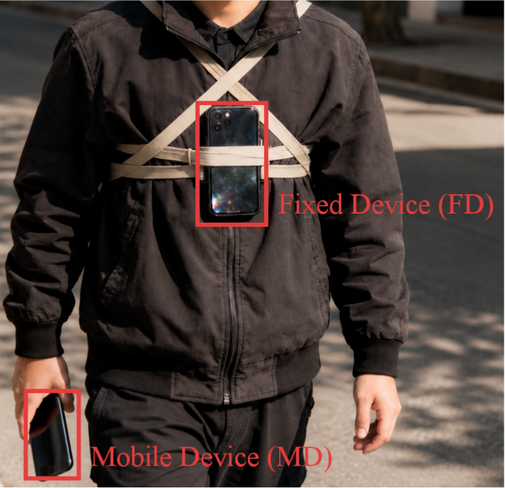
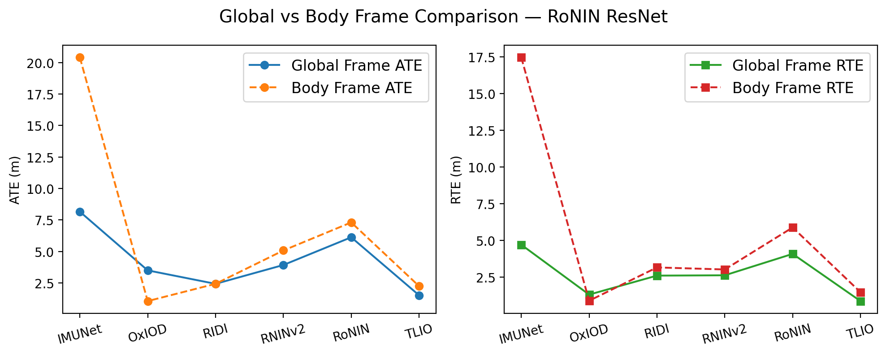
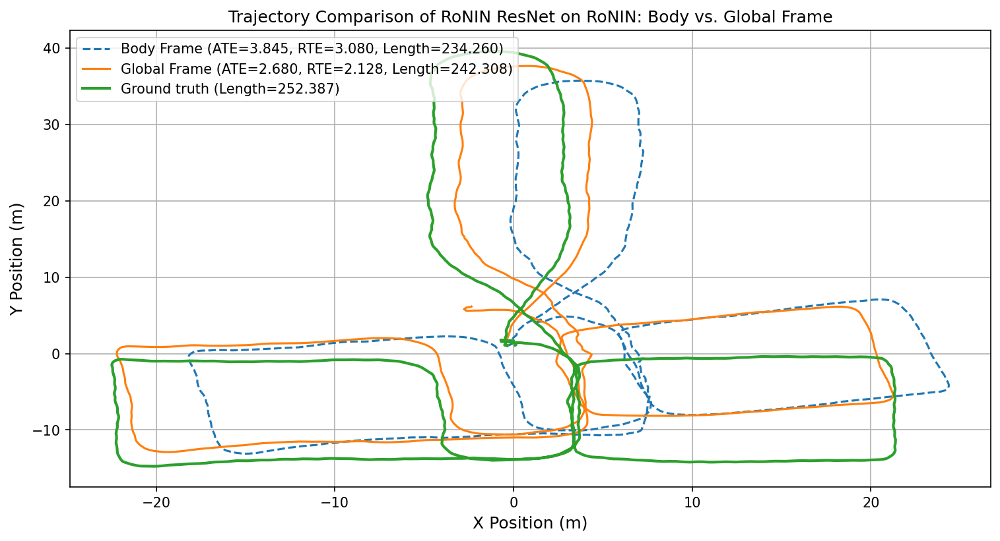

# Global Frame vs Body Frame Representation in Pedestrian Inertial Odometry

**Language:** [简体中文](README.md) | English

This repository documents an experimental and analytical study on **coordinate-frame representations in learning-based Pedestrian Inertial Odometry (Pedestrian IO)**. The work was motivated by a practical conflict observed during paper review: in TLIO/RoNIN-style pedestrian IO, rotating IMU measurements into a gravity-aligned global frame often improves localization accuracy; however, related drone inertial odometry work such as AirIO reports that learning directly in the body/device frame while preserving gravity can be more effective. These conclusions appear contradictory at first glance.

The purpose of this repository is not to propose a complete new algorithm, but to isolate and explain this specific issue: **why does a body-frame learning strategy that works for drone IO not necessarily transfer to pedestrian IO? Why is the global/HACF representation often more stable and easier to learn for pedestrian motion?**

---

## Contents

- [Motivation](#motivation)
- [Data Collection Setup and Key Difference](#data-collection-setup-and-key-difference)
- [Coordinate Frame Definitions](#coordinate-frame-definitions)
- [Experimental Protocol](#experimental-protocol)
- [Results](#results)
- [Theoretical Explanation](#theoretical-explanation)
- [Difference from AirIO-like Drone IO](#difference-from-airio-like-drone-io)
- [Main Conclusions](#main-conclusions)
- [Suggested Repository Structure](#suggested-repository-structure)

---

## Motivation

Pedestrian inertial odometry estimates a pedestrian trajectory using only consumer-grade IMU measurements, typically acceleration and angular velocity. Recent learning-based systems such as RoNIN and TLIO commonly include a preprocessing step: using AHRS estimates or dataset-provided quaternions, raw IMU measurements are rotated from the device frame to a unified global frame, or more precisely, a **heading-agnostic coordinate frame (HACF)**. The defining property of this frame is that its **z-axis is aligned with gravity**, while the horizontal heading does not need to be uniquely fixed.

In our previous experiments, we observed that for TLIO/RoNIN-style data, training and inference with gravity-aligned global/HACF representations led to lower localization error. During review, however, the reviewer pointed out that AirIO-like drone IO learns in the body/device frame and keeps the gravity component, and reported better performance. This motivated a systematic comparison under pedestrian IO settings.

We therefore retrained and evaluated the same network under two representation pipelines: **global-frame learning** and **body-frame learning**.

---

## Data Collection Setup and Key Difference

The data collection protocol of RoNIN-style pedestrian IO is fundamentally different from that of drone IO. In the example below, the ground-truth trajectory is obtained from a chest-mounted tracking device or an external tracking system, while IMU measurements are collected by another smartphone carried in an arbitrary manner.



We use the following terminology:

- **CAR / carrier**: the body or reference carrier whose motion is used as trajectory ground truth, approximated by a chest-mounted device or the pedestrian body.
- **DEV / device**: the mobile device that actually records IMU measurements, such as a handheld or pocketed phone.
- **global frame / HACF**: a global or heading-agnostic coordinate frame whose z-axis is aligned with gravity.
- **body frame / device frame**: the instantaneous coordinate frame of the IMU device.

In drone IO, the IMU is usually rigidly mounted on the vehicle body, so the relative pose between DEV and CAR is fixed or calibrated. In pedestrian IO, however, the phone and the human body undergo substantial non-rigid, random, and time-varying relative motion. Hand swing, pocket motion, and arbitrary phone orientation introduce local disturbances that are not part of the pedestrian body's global motion.

This is the key reason why the two task settings lead to different conclusions.

---

## Coordinate Frame Definitions

Ignoring measurement noise, the acceleration of DEV in the global frame can be written as:

$$
a_{\mathrm{DEV}}^{g}=a_{\mathrm{CAR}}^{g}+a_{\mathrm{LOC}}^{g}
$$

where:

- $a_{\mathrm{DEV}}^{g}$ is the global-frame acceleration corresponding to the device IMU measurement;
- $a_{\mathrm{CAR}}^{g}$ is the acceleration of the pedestrian carrier in the global frame;
- $a_{\mathrm{LOC}}^{g}$ is the local disturbance caused by the device moving relative to the human body.

In the device's own body/device frame, the measured acceleration is:

$$
a_{\mathrm{DEV}}^{d}=R_{g\to d}a_{\mathrm{DEV}}^{g}
=R_{g\to d}a_{\mathrm{CAR}}^{g}+R_{g\to d}a_{\mathrm{LOC}}^{g}
$$

where $R_{g\to d}$ is the rotation matrix from the global frame to the device frame.

In practical preprocessing, AHRS or dataset-provided orientation estimates provide $\hat{R}_{d\to g}$, which is used to rotate raw measurements into the global/HACF frame:

$$
\hat{a}_{\mathrm{DEV}}^{g}=\hat{R}_{d\to g}a_{\mathrm{DEV}}^{d}, \qquad
\hat{R}_{d\to g}R_{g\to d}\approx I
$$

If the orientation estimate were perfect, the global representation would explicitly remove device orientation changes. In practice, $\hat{R}_{d\to g}$ is noisy. The real question is whether the cost of this orientation error is smaller than the learning difficulty caused by random orientation and local disturbances in the body frame. For pedestrian IO, our experiments suggest that it usually is.

---

## Experimental Protocol

We retrained and evaluated the same type of network under two coordinate-frame settings.

### 1. Global/HACF-frame setting

In the global/HACF setting:

1. Dataset-provided quaternions or AHRS estimates are used to rotate raw IMU measurements from the device frame to the global/HACF frame.
2. The network input consists of acceleration and angular velocity represented in the global/HACF frame.
3. Labels remain in the global or HACF frame, usually corresponding to horizontal 2D velocity or displacement.
4. The predicted velocities/displacements are integrated to reconstruct the pedestrian trajectory.

This follows the common preprocessing pipeline used by RoNIN/TLIO-style pedestrian IO methods.

### 2. Body/device-frame setting

In the body/device-frame setting:

1. Raw IMU measurements are kept in the device coordinate frame.
2. Position or velocity labels are rotated into the device frame using the corresponding orientation quaternions.
3. The network learns device-frame velocity/displacement directly from device-frame IMU signals.
4. At inference time, predictions are rotated back to the global frame for trajectory reconstruction and error evaluation.

This is closer to the idea of learning directly in the carrier/body frame, as in AirIO-like work.

### 3. Metrics

We use two standard inertial odometry metrics:

- **ATE (Absolute Trajectory Error)**: measures global position error between the estimated trajectory and ground truth.
- **RTE (Relative Trajectory Error)**: measures local relative trajectory error within a fixed-length window and reflects short-term drift.

---

## Results

The figure below compares global-frame and body-frame representations for RoNIN ResNet across multiple datasets. Overall, the global-frame representation is more stable and produces lower errors in most datasets and metrics.



Key observations:

- On the IMUNet dataset, the body-frame representation leads to much larger errors, indicating that the model struggles to learn stable motion patterns from strongly orientation-coupled raw device-frame signals.
- On RoNIN and RNIN, the global-frame setting also achieves lower ATE/RTE.
- Body-frame performance may be close to the global frame on a few datasets or metrics, but the overall stability is worse.

The next figure visualizes one representative trajectory. The blue dashed curve is the body-frame prediction, the orange curve is the global-frame prediction, and the green curve is the ground truth.



This trajectory shows that:

- the global-frame trajectory better follows the ground truth;
- the body-frame result is more likely to distort turns and loop structures;
- although the body-frame model can still learn part of the motion trend, its error is more easily amplified by orientation changes and local device disturbances.

---

## Theoretical Explanation

### 1. Carrier motion and local disturbance are easier to separate in the global frame

In the global/HACF representation:

$$
a_{\mathrm{DEV}}^{g}=a_{\mathrm{CAR}}^{g}+a_{\mathrm{LOC}}^{g}
$$

This has a clear physical interpretation: the device measurement is a linear combination of the pedestrian carrier motion and local device disturbance. Pedestrian carrier motion is usually low-frequency, continuous, and constrained mainly to the horizontal plane. Local disturbances, such as hand swing and phone shaking, are more local and often higher-frequency. Their statistical characteristics are therefore easier for a neural network to distinguish and suppress in the global/HACF frame.

### 2. Body frame couples all motion components with device orientation

In the body/device frame:

$$
a_{\mathrm{DEV}}^{d}=R_{g\to d}a_{\mathrm{CAR}}^{g}+R_{g\to d}a_{\mathrm{LOC}}^{g}
$$

Both the carrier motion and local disturbance are modulated by the instantaneous device orientation $R_{g\to d}$. For handheld or pocketed phones, this orientation can change rapidly and randomly. As a result, the same pedestrian motion can appear with very different component distributions in the device frame. This produces representation discontinuities, unstable velocity labels, and a more difficult learning target.

### 3. Output dimensionality and motion constraints differ

In the global/HACF frame, pedestrian motion mainly occurs on the horizontal plane. The model usually only needs to learn horizontal velocity or displacement trends. Small vertical motion contributes relatively little to final 2D localization.

In the body/device frame, the same smooth horizontal motion is continuously rotated into all three device axes. The model must simultaneously learn:

1. the true pedestrian carrier motion;
2. the changing device orientation;
3. the local relative motion between the device and the body;
4. the relation needed to recover a global trajectory from device-frame predictions.

This makes body-frame learning substantially harder for pedestrian IO.

---

## Difference from AirIO-like Drone IO

In AirIO-like drone IO, body-frame learning may be effective because the drone approximately satisfies a rigid-body assumption:

$$
a_{\mathrm{LOC}}^{g}\approx 0
$$

That is, the IMU and the vehicle body center have an almost fixed relative pose. The IMU observation can therefore represent the carrier motion well. Under this condition, keeping the body-frame representation and gravity may provide direct dynamics information and avoid contaminating the input with orientation-estimation errors.

Pedestrian IO does not satisfy this assumption. A smartphone is not rigidly fixed at the human body's center of mass; it moves relative to the body. Therefore:

- in drone IO, the device frame is close to the carrier frame;
- in pedestrian IO, the device frame is usually not the carrier frame, but a random frame driven by hand, pocket, or local body motion.

Thus, conclusions from AirIO-like drone IO cannot be directly generalized to pedestrian IO. Coordinate-frame selection is task-dependent and should be interpreted through the carrier-sensor coupling relationship.

---

## Main Conclusions

This repository supports the following conclusions:

1. **For pedestrian IO, the global/HACF frame is generally more suitable than the body/device frame for learning-based localization models.**
2. This is not because the global frame contains more information mathematically, but because it provides a more stable representation that better matches pedestrian motion constraints.
3. The success of body-frame learning in drone IO relies heavily on the rigid mounting assumption, which usually does not hold for handheld or pocketed phones in pedestrian IO.
4. The main difficulty in pedestrian IO is not simple coordinate rotation, but the time-varying, non-rigid, and unobservable local motion between DEV and CAR.
5. The global/HACF representation partially decouples human-body motion from local device disturbance, making model training and trajectory reconstruction easier.

---

## Suggested Citation

```bibtex
@misc{pedestrian_io_frame_analysis,
  title  = {Global Frame vs Body Frame Representation in Pedestrian Inertial Odometry},
  author = {BUG423},
  year   = {2026},
  url    = {https://github.com/BUG423/inertial-positioning-benchmark/tree/main/research/studies/pedestrian-coordinate-frames},
  note   = {Experimental study}
}
```

---

## Note

This repository records an isolated experimental observation and analysis perspective. It can serve as motivation for future method design or as supplementary material explaining why coordinate-frame choices differ between pedestrian IO and drone IO. The current conclusions are based mainly on RoNIN/TLIO-style data organization and experimental protocols. If device mounting, ground-truth definition, or orientation estimation changes, the relative advantage of global-frame versus body-frame learning should be re-evaluated experimentally.
